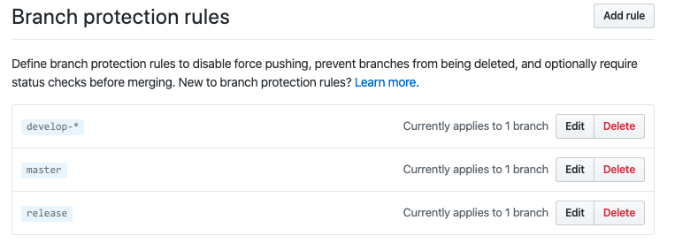

= 学习代码审核

这篇文章 https://ken.io/note/gitlab-code-review-tutorial[基于GitLab的Code Review教程^]写得不错

//如何查看 git 当前所使用的用户
.大致流程
* 首先 项目需要有多个参与者
* 然后 设置参与者对项目的 push、merge 权限，
* feature 分支开发完成后，发起 pull request
* pull request 通知到项目组成员，让其审核代码
* 审核无误，合并代码

== Branch protection rules

并没有感受到分支有被保护的感觉。